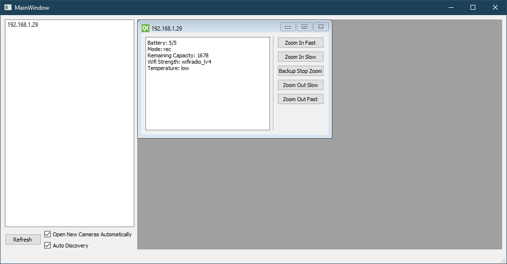
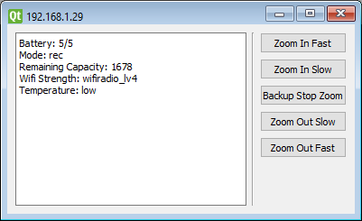

# Simple Zoom Controller For Camcorder

I built this application for a broadcasting project that requires remote zoom control of a camera or camcorder. 
This program was tested against a Panasonic HC-W580 camcorder and may work with some other modern (as of 2020)
Panasonic camcorders. However, I make no promises regarding compatibility with other camera models.
 
Currently the program supports all zoom commands and will show the relevant parts of the device state.
The framework for the actual camera controller should make it relatively easy to add support for additional commands
with knowledge of the API commands. 

The application is build on top of PySide2/Qt. 

## Installation

Clone or copy the repo and run the following command from the root directory.

`python3 setup.py install`

Alternatively you can run the following command from the root directory.

`pip3 install .`

It is recommended that this program is installed in a virtual environment.
You can create a virtual environment with the following command.

`python3 -m venv venv`

Activate the environment and perform the above installation steps.

## Usage

- **Auto Discovery** - Continually send out device discovery broadcasts. When a new device is discovered add it to the list.
- **Open New Cameras Automatically** - Automatically open new cameras as they are discovered.
- **Refresh** - Clear the camera list and immediately send out a single camera discovery broadcast.

- **Zoom In Fast** *SHIFT + UP ARROW* - Fast zoom in. 
- **Zoom In Slow** *UP ARROW* - Normal zoom in. 
- **Backup Stop Zoom** *END* - On the off chance zoom fails to stop this will send out another stop command.
- **Zoom Out Slow** *DOWN ARROW* - Normal zoom out. 
- **Zoom Out Fast** *SHIFT + DOWN ARROW* - Fast zoom out. 

Zoom commands will continue until the button or shortcut key is released.

## Requirements

This program requires Python 3.7 or greater and PySide2.

## License

This project is licensed under GPL 3.